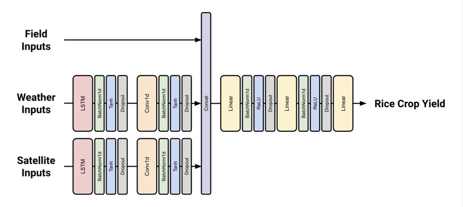
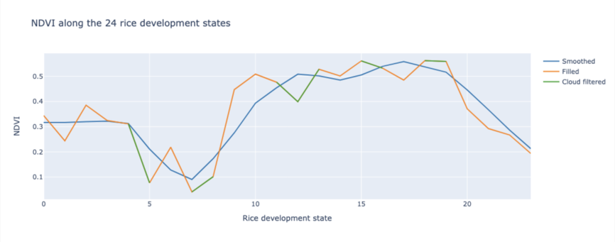

# 2023 EY Open Science Data Challenge - Crop forecasting

## Project Description
The project 2023 EY Open Science Data Challenge - Crop Forecasting is a Data Science project conducted as part of the challenge proposed by EY, Microsoft, and Cornell University. The objective of this project is to predict the yield of rice fields using satellite image data provided by Microsoft Planetary, meteorological data, and field data.

## Model architecture

## Data pre-processing

## Documentation
The project documentation, generated using Sphinx, can be found in the `docs/` directory. It provides detailed information about the project's setup, usage, implementation, tutorial.

## References

Jeong, S., Ko, J., & Yeom, J. M. (2022). Predicting rice yield at pixel scale through synthetic use of crop and deep learning models with satellite data in South and North Korea. Science of The Total Environment, 802, 149726.

Nazir, A., Ullah, S., Saqib, Z. A., Abbas, A., Ali, A., Iqbal, M. S., ... & Butt, M. U. (2021). Estimation and forecasting of rice yield using phenology-based algorithm and linear regression model on sentinel-ii satellite data. Agriculture, 11(10), 1026.

## Contributors

 Baptiste URGELL 

 Louis REBERGA
