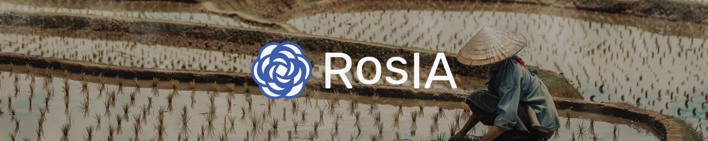

# 🍚 Crop Forecasting



The project 2023 EY Open Science Data Challenge - Crop Forecasting is a Data Science project conducted as part of the challenge proposed by EY, Microsoft, and Cornell University. The objective of this project is to predict the yield of rice fields using satellite image data provided by Microsoft Planetary, meteorological data, and field data.

## 🏆 Challenge ranking
The score of the challenge was the R2 score.  
Our solution was the 4th (out of 185 teams) one with a R2 score equal to 0.66 🎉.

The podium:  
🥇 Outatime - 0.68  
🥈 Joshua Rexmond Nunoo Otoo - 0.68  
🥉 Amma Simmons - 0.67  

## 🛠️ Data processing


## 🏛️ Model architecture


## 📚 Documentation
The project documentation, generated using Sphinx, can be found in the `docs/` directory. It provides detailed information about the project's setup, usage, implementation, tutorial.

## 🔬 References

Jeong, S., Ko, J., & Yeom, J. M. (2022). Predicting rice yield at pixel scale through synthetic use of crop and deep learning models with satellite data in South and North Korea. Science of The Total Environment, 802, 149726.

Nazir, A., Ullah, S., Saqib, Z. A., Abbas, A., Ali, A., Iqbal, M. S., ... & Butt, M. U. (2021). Estimation and forecasting of rice yield using phenology-based algorithm and linear regression model on sentinel-ii satellite data. Agriculture, 11(10), 1026.

## 📝 Citing

```
@misc{UrgellReberga:2023,
  Author = {Baptiste Urgell and Louis Reberga},
  Title = {Crop forecasting},
  Year = {2023},
  Publisher = {GitHub},
  Journal = {GitHub repository},
  Howpublished = {\url{https://github.com/association-rosia/crop-forecasting}}
}
```

## 🛡️ License

Project is distributed under [MIT License](https://github.com/association-rosia/crop-forecasting/blob/main/LICENSE)

## 👨🏻‍💻 Contributors <a name="contributors"></a>

Louis
REBERGA <a href="https://twitter.com/rbrgAlou"></a> <a href="https://www.linkedin.com/in/louisreberga/"></a> <a href="louis.reberga@gmail.com"></a>

Baptiste
URGELL <a href="https://twitter.com/Baptiste2108"></a> <a href="https://www.linkedin.com/in/baptiste-urgell/"></a> <a href="baptiste.u@gmail.com"></a> 
